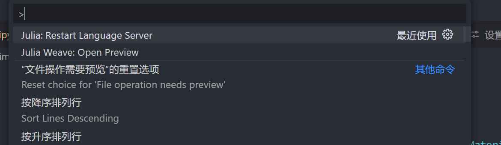
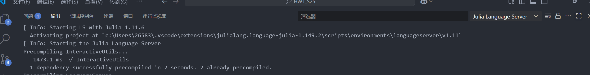
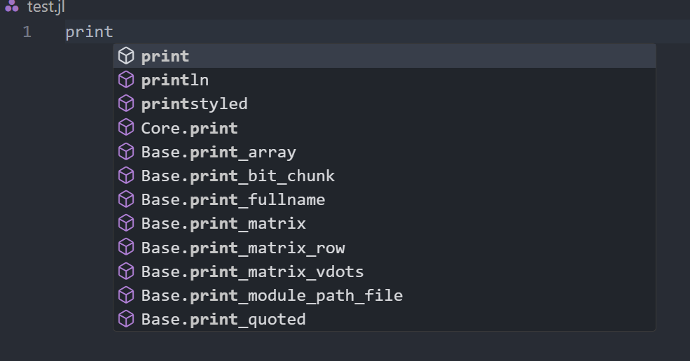

我之前已经在 VS Code 中配置好了 Julia，但后来重新写代码时，发现 IntelliSense 不再补全。检查语言服务器日志后，发现当时语言服务器没有正常启动，日志提示缺少 Juliaup 的 `release` 通道。

下面记录的是当时的处理经历。类似的补全现象可能有不同原因，先检查日志，再决定是否需要安装通道。

## 1. 从语言服务器日志开始

按 `Ctrl+Shift+P` 打开命令面板，执行 `Julia: Restart Language Server`，扩展给出了以下提示：

```text
You must have the "release" channel in Juliaup installed
for the best Julia experience in VS Code.
```



这一提示说明当时的 Juliaup 环境缺少扩展需要的 `release` 通道。不能由此推断所有补全问题都来自同一个原因，也不能把它写成所有版本扩展必须使用某个固定 Julia 版本的规则。

## 2. 安装 release 通道

根据这条提示，使用 Juliaup 的通道管理命令检查并安装 `release`：

```powershell
juliaup status
juliaup add release
```

当时记录的安装输出是：

```text
Checking for new Julia versions
Installing Julia 1.11.6+0.x64.w64.mingw32
```

`release` 表示稳定发布通道，具体版本随时间变化；1.11.6 是当时输出，不是现在安装时必须得到的版本。该命令不要求更改已有项目的兼容约束。



## 3. 重启并观察恢复过程

安装后重启 VS Code。Julia 扩展找到了所需版本，语言服务器开始创建环境，初始化后补全恢复了。可以在“查看 → 输出”中选择 `Julia Language Server` 观察日志，等待初始化结束后再检查补全。



验证时可以依次检查：

- 日志是否仍然报告 `release` 通道缺失或启动失败。
- `.jl` 文件是否被识别为 Julia 语言。
- 输入 `using LinearAlgebra` 后，函数补全与悬停说明是否工作。
- 正在使用的项目环境是否与代码依赖匹配。

## 4. 如果还没有恢复

确认扩展启用，并核对 Julia 路径。如果此前手动设置了 `julia.executablePath`，检查是否仍然指向有效程序；扩展的自动发现与显式路径设置可能不同。具体行为参考 [Julia VS Code 扩展说明](https://github.com/julia-vscode/julia-vscode#configure-the-julia-extension)。

从这次经历来看，更建议先检查启动日志、Juliaup 通道列表、扩展版本与项目环境，缩小故障范围，而不是一开始就删除整个 Julia 包缓存。笔记中没有记录扩展版本，也未保留完整初始化日志，因此不能保证这套处理方式适用于其他版本组合。

## 整理与核查说明

**核查状态：部分验证（2026-10-04）。** 已核对 Juliaup 命令及日志的适用条件；原 VS Code 扩展版本缺失，未复现完整故障。

本文整理自我的[知乎原文](https://zhuanlan.zhihu.com/p/1927391566026236212)。原页面显示更新时间为 2025-07-12 16:22，首发日期尚未确认；文章上方日期为博客整理日期。2026-10-04 整理时保留了当时的版本输出与截图，并补充排查范围说明；未在新环境重新复现该故障。

## 参考资料

- [我的知乎原文](https://zhuanlan.zhihu.com/p/1927391566026236212)
- [Juliaup：版本与通道管理](https://github.com/JuliaLang/juliaup)
- [Julia VS Code 扩展](https://github.com/julia-vscode/julia-vscode)
- [Julia 社区](https://discourse.julialang.org/)
