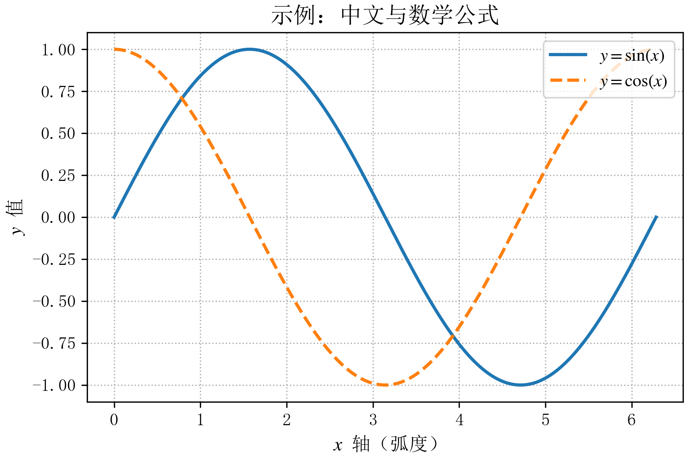
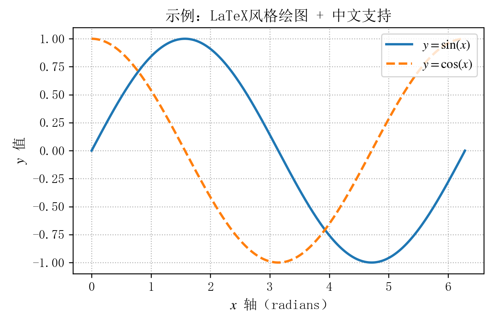

我在整理课程笔记和实验图时，希望中文、数学公式和字号保持一致，也希望分别控制屏幕显示与图片导出的分辨率。这篇笔记以当时的绘图配置为基础，介绍如何检查字体、统一样式，以及用局部配置绘制和保存图片。

## 1. 先确认需要什么字体

`text.usetex=False` 时，公式由 Matplotlib 的 Mathtext 渲染，无须安装完整 TeX。Mathtext 支持的是 TeX 数学语法的子集，不能直接承载任意 LaTeX 宏包或命令。见[官方数学文本说明](https://matplotlib.org/stable/users/explain/text/mathtext.html)。

中文显示仍需要系统安装中文字体。配置中的字体列表只是候选，不会自动下载字体。可以先查看 Matplotlib 能找到哪些字体：

```python
from matplotlib import font_manager

names = sorted({font.name for font in font_manager.fontManager.ttflist})
print("\n".join(name for name in names if any(
    keyword in name for keyword in ("SimSun", "Songti", "Noto", "YaHei")
)))
```

Windows 可尝试宋体或微软雅黑，macOS 可检查 Songti SC，Linux 可检查 Noto CJK。名称必须以本机实际结果为准。

## 2. 可复用配置

```python
import matplotlib.pyplot as plt

config = {
    "text.usetex": False,
    "font.family": "serif",
    "font.serif": [
        "SimSun", "NSimSun", "Noto Serif CJK SC", "Songti SC",
        "Times New Roman", "DejaVu Serif",
    ],
    "font.sans-serif": [
        "SimHei", "Microsoft YaHei", "Noto Sans CJK SC",
        "Heiti TC", "Arial", "DejaVu Sans",
    ],
    "font.size": 12,
    "axes.labelsize": 12,
    "legend.fontsize": 11,
    "xtick.labelsize": 11,
    "ytick.labelsize": 11,
    "mathtext.fontset": "stix",
    "figure.dpi": 150,
    "savefig.dpi": 300,
    "axes.unicode_minus": False,
}
```

`stix` 控制数学字体集合。此前的配置还同时设置了 `mathtext.rm/it/bf`；这里保留内置的 `stix` 集合，去掉这些自定义数学字体设置，使配置意图更明确。若要逐项自定义数学字体，应查阅 `mathtext.fontset="custom"` 的用法。

`axes.unicode_minus=False` 让刻度使用普通连字符显示负号，是兼容设置；若字体支持 Unicode 负号，也可以保留默认设置。

## 3. 完整绘图与导出示例

下面代码接在上述 `config` 定义之后。`rc_context` 把样式限定在这一张图中，适合在同一个 Notebook 里绘制不同风格的图。

```python
import numpy as np

x = np.linspace(0, 2 * np.pi, 200)

with plt.rc_context(config):
    fig, ax = plt.subplots(figsize=(6, 4), layout="constrained")
    ax.plot(x, np.sin(x), label=r"$y = \sin(x)$", linewidth=2)
    ax.plot(x, np.cos(x), label=r"$y = \cos(x)$", linestyle="--", linewidth=2)
    ax.set_title("示例：中文与数学公式")
    ax.set_xlabel(r"$x$ 轴（弧度）")
    ax.set_ylabel(r"$y$ 值")
    ax.legend(loc="upper right")
    ax.grid(True, linestyle=":")

    fig.savefig("mathtext-example.png", dpi=300)
    fig.savefig("mathtext-example.pdf")
    plt.show()
```

图像应先保存再显示；阻塞式 `show()` 结束后，使用 `plt.savefig()` 可能保存到新的空图。这里保留 `fig` 引用并使用 `fig.savefig()`，也让保存对象更明确。见 [`show` 的官方说明](https://matplotlib.org/stable/api/_as_gen/matplotlib.pyplot.show.html)。

布局统一采用 `layout="constrained"`，避免同时叠加 `figure.autolayout` 和 `tight_layout()`。PNG 是栅格输出，分辨率会影响尺寸和清晰度；PDF 中的线条与文本通常可以保留为矢量，图中的栅格对象仍受分辨率影响。

### 本次示例输出



本次整理在 Windows、Python 3.13.9、NumPy 2.3.5、Matplotlib 3.10.6 环境执行了上面的配置和完整绘图代码；中文字体实际匹配到 SimSun，数学字体为 STIX。PNG 为 1800×1200，另生成了 PDF。这里采用非交互后端检查导出，未验证 Notebook 或 GUI 的显示行为，也不代表其他系统已安装相同字体。

[本次导出的 PDF](https://github.com/langxin11/Mizuki_Content_XDL/blob/main/posts/%E7%9F%A5%E4%B9%8E%E8%BF%81%E5%85%A5/matplotlib-chinese-mathtext/mathtext-example.pdf)。字体选择应以读者自己的环境为准。

### 旧笔记配图



上图来自此前的绘图笔记，不能用来验证这里调整后的示例代码。

## 4. 常见问题

| 现象 | 检查方式 |
| --- | --- |
| 中文变成方框 | 确认中文字体已安装，并能被 `font_manager` 找到 |
| 不同电脑字体不同 | 核对候选列表与本机字体；对需严格复现的图固定可用字体 |
| 数学公式报错 | 检查 `$...$` 是否成对，命令是否属于 Mathtext 支持范围 |
| 导出空图 | 在 `show()` 之前保存，或使用保留的 `fig` 引用 |
| 标题或标签裁剪 | 使用一种布局管理方式，并检查最终输出文件 |

## 整理与核查说明

**核查状态：已核查（2026-10-04）。** 迁入示例已在 Matplotlib 3.10.6 生成 PNG/PDF；验证限于该环境，不保证所有系统都安装同一字体。

本文整理自我的[知乎绘图配置笔记](https://zhuanlan.zhihu.com/p/1968340656729589624)。原页面显示更新时间为 2026-08-28 21:35，首发日期尚未确认；文章上方日期为博客整理日期。2026-10-04 整理时补充了字体检查、配置作用域与完整示例，并调整了数学字体和布局设置。修订示例已在本次核查环境中生成 PNG、PDF；“本次示例输出”为此次运行产物，“旧笔记配图”保留此前图片，两者分开标明。

## 参考资料

- [我的知乎原文](https://zhuanlan.zhihu.com/p/1968340656729589624)
- [Matplotlib：数学文本](https://matplotlib.org/stable/users/explain/text/mathtext.html)
- [Matplotlib：show 与保存顺序](https://matplotlib.org/stable/api/_as_gen/matplotlib.pyplot.show.html)
- [原参考：中文及英文字体设置](https://hscyber.github.io/posts/7c8b9f60/)
- [原参考：宋体与 Times New Roman 混排](https://zhuanlan.zhihu.com/p/627517045)
