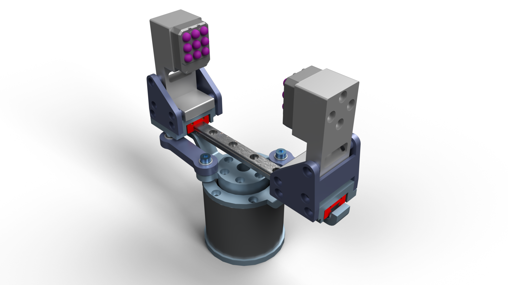
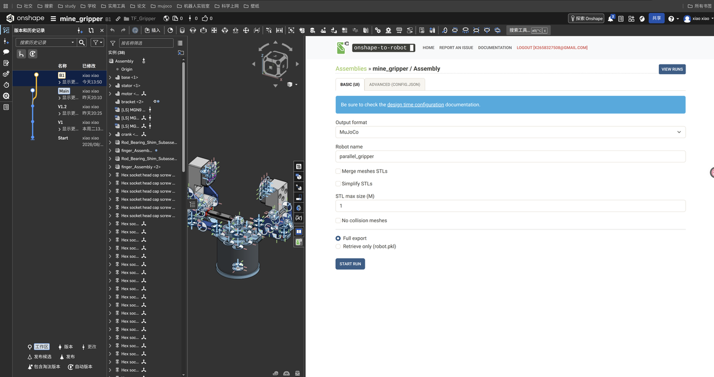

为了给后续触觉力控算法准备仿真模型，我使用 Onshape App Store 中的 Onshape-to-Robot 应用，将曲柄—滑块机构的平行二指夹爪导出为 MuJoCo MJCF。

这篇笔记主要记录装配体划分、关节命名和闭链导出配置。CAD 导出不仅要生成 XML，还要让工具正确理解刚体、关节和闭链；运动自由度、闭环约束和指尖接触几何体都需要单独检查。



[Onshape 模型文档](https://cad.onshape.com/documents/ee6a871f9e00fc227503180b/w/c90cab421a5e9546e31f5c11/e/16b75a7cc71174b7cd5960db)。夹爪开合视频可以在[知乎文章](https://zhuanlan.zhihu.com/p/2077353580063896559)中查看。

## 1. 导出前先整理装配体

[Onshape-to-Robot](https://github.com/rhoban/onshape-to-robot)可以在本地通过 Python 与 Onshape API 使用，也可以通过 Onshape App Store 应用使用。这里记录的是 App Store 应用的使用流程。

工作流程如下：

```text
CAD 建模与顶层 Assembly
    → 划分刚体、建立 Mate
    → 按规则命名并检查关节轴
    → 选择闭环断点、建立参考坐标系
    → 配置导出参数
    → 导出 MJCF 与 mesh assets
    → 拓扑、空载运动、接触仿真验证
```

导出工具会结合顶层装配体、Mate 类型、名称及 Mate Connector 的方向推断机器人拓扑。因此应先完成以下整理：

- 将没有相对运动的零件固连，避免导出为多余的活动刚体。
- 将具有相对运动的机构单元划分为独立刚体。
- 核对导出工具的基座选择规则；这个模型将基座实例放在装配体第一位。
- 为关节和闭环连接设置明确的名称。
- 为触觉阵列、抓取中心等需要读取位姿的位置建立参考坐标系。

## 2. Mate 命名与坐标轴

这个模型的命名约定如下，实际规则须结合所用导出工具版本核对。

| 命名形式 | 作用 | 示例 |
| --- | --- | --- |
| `dof_*` | 普通运动关节 | `dof_gripper_drive` |
| `fix_*` | 固定关系、刚体合并 | `fix_crank_to_rotor` |
| `closing_*` | 闭环连接 | `closing_left_link_finger_pin` |
| `frame_*` | 导出参考坐标系为 site | `frame_left_taxel_01` |
| `*_inv` | 按导出规则反转关节方向 | `dof_gripper_drive_inv` |
| `link_*` | 显式指定 link 名称 | `link_left_finger` |

这些名称应设置在相应的 Mate、Mate Connector 或工具规定的实体上，不能仅给 CAD 零件改名后就认为关节已经识别。尤其 `link_*` 设置在附着于目标实例的 Mate Connector 上；当前开源工具的规则见[设计约定](https://onshape-to-robot.readthedocs.io/en/latest/design.html)。App 的具体版本未记录，不能据此保证其全部界面和配置与开源工具完全相同。

对于 Revolute Mate，检查 Mate Connector 的 Z 轴是否沿转轴；对于 Slider Mate，检查 Z 轴是否沿滑动方向。若导出后的正方向与预期相反，再核查连接顺序、轴向及 `_inv` 规则。

模型使用 `frame_left_taxel_*` 和 `frame_right_taxel_*` 保存左右指尖触觉阵列的参考位置。导出为 `<site>` 后，可以用于位姿读取与坐标变换；这些 site 本身并不自动构成触觉传感器。

## 3. 划分夹爪的运动学刚体

夹爪由单电机驱动中心曲柄，再通过两侧对称连杆推动手指沿 MGN9 导轨运动。

| 刚体 | 主要零件 | 上级关节 | 类型与驱动 |
| --- | --- | --- | --- |
| `gripper_base` | 基座、定子、支架、导轨 | 固定到世界 | 固定 |
| `drive_crank` | 电机转子、曲柄 | `dof_gripper_drive` | Hinge，主动 |
| `left_link` | 左连杆、轴承、垫片 | `dof_left_link_crank_pin` | Hinge，被动 |
| `right_link` | 右连杆、轴承、垫片 | `dof_right_link_crank_pin` | Hinge，被动 |
| `left_finger` | 左滑块、手指、触觉阵列 | `dof_left_finger_slide` | Slide，被动 |
| `right_finger` | 右滑块、手指、触觉阵列 | `dof_right_finger_slide` | Slide，被动 |

左右两侧各有一个闭环：

```text
base → drive_crank → link → finger → base
```

MJCF 的 body 层级采用树状结构，因此模型将“连杆 ↔ 手指”的连接选为闭环断点：

```text
closing_left_link_finger_pin
closing_right_link_finger_pin
```

普通关节先组成树状拓扑，再用 equality 约束恢复断开的连接。闭环类型决定约束形式：当时使用的导出流程对 Fastened 使用 weld，对球铰使用 connect，对 Revolute 闭环使用两组 connect。

## 4. 为什么转动闭环使用两个 connect

单个位置连接约束使两个点重合，仍允许两个刚体相对转动。为了仅保留绕销轴的转动，当时使用的导出工具沿 Mate Connector 的 Z 轴增加一对偏置 site：

```text
中心点：      site_left   ↔ site_right
轴向偏置点：  site_left_z ↔ site_right_z
```

两组点连接共同约束中心位置和轴线方向，保留绕轴的相对转动。两点位置约束之间可能存在冗余，不能简单把两条 connect 当作六个独立约束。数值行为还取决于初始装配状态、求解器与约束软化参数。

对这个夹爪模型，两侧各两组，因此预期导出 4 条 connect。下面统一使用与 Mate 命名一致的 site 名字作示意，**应用时必须替换为实际导出的名字**：

```xml
<equality>
  <connect site1="closing_left_link_finger_pin_1"
           site2="closing_left_link_finger_pin_2"
           solref="0.002 1" solimp="0.99 0.999 0.0005 0.5 2"/>
  <connect site1="closing_left_link_finger_pin_1_z"
           site2="closing_left_link_finger_pin_2_z"
           solref="0.002 1" solimp="0.99 0.999 0.0005 0.5 2"/>
  <connect site1="closing_right_link_finger_pin_1"
           site2="closing_right_link_finger_pin_2"
           solref="0.002 1" solimp="0.99 0.999 0.0005 0.5 2"/>
  <connect site1="closing_right_link_finger_pin_1_z"
           site2="closing_right_link_finger_pin_2_z"
           solref="0.002 1" solimp="0.99 0.999 0.0005 0.5 2"/>
</equality>
```

此前记录的左侧 equality 示例与 Mate 名称存在差异；上面的示意名已统一，但不能据此确认实际导出的 XML 也使用这一名称。

`site1/site2` 形式在 MuJoCo 3.2.3 引入，3.2.5 又修复了相关约束惯性和力/力矩传感器等问题；旧版不能照抄此 XML，复现应记录并使用包含这些修复的版本。见 [MuJoCo 更新记录](https://mujoco.readthedocs.io/en/stable/changelog.html#version-3-2-5-nov-4-2024)。两 site 若在初始配置不重合，启动时约束会试图把它们拉到一起，可能产生瞬态，须先核对装配位姿。

## 5. 碰撞配置与求解参数

完整 CAD 往往包含螺钉、轴承和内部细节。让所有 mesh 都参与碰撞，会增加求解负担，也可能把装配干涉转化为不必要的接触内力。

本模型的碰撞配置采用白名单方式：先只保留触觉柱阵列的碰撞，再按需要加入基座、定子、支架和导轨。具体匹配规则见末尾配置中的 `ignore`，零件名称必须与实际模型一致。

当时使用的配置包括：

```xml
<option solver="Newton" timestep="0.002"/>
```

以及 equality 的 `solref="0.002 1"`、`solimp="0.99 0.999 0.0005 0.5 2"`。它们是当时记录的起始参数，并非闭链机构的通用推荐值。正值 `solref` 的首项是时间常数；默认启用 `refsafe` 时，其有效值不会小于两倍时间步。因此在 `timestep=0.002` 下，上述名义 `0.002` 会按至少 `0.004` 处理，不能把“填得更小”直接理解为更硬、更精确。见 [MuJoCo 求解参数](https://mujoco.readthedocs.io/en/stable/modeling.html#solver-parameters)。这些约束是软约束，应测量闭环残差，不能仅看动画无明显变形。

## 6. 在 App 中导出

1. 打开目标顶层 Assembly，启动 Onshape-to-Robot App。
2. 将输出格式设为 MuJoCo，设置模型名称与 mesh 输出目录。
3. 加载或填写 `config.json`，核对碰撞和关节配置。
4. 执行导出，保存 XML 和 mesh assets，保持相对路径有效。



## 7. 按三个阶段验证

**拓扑检查：**确认仅驱动关节有 actuator；两侧闭环都有所需的中心与轴向约束；`frame_*` 已导出为 site；所有 XML 引用和 mesh 路径存在。

**空载运动：**先在无外部接触下给主动关节施加平滑信号，检查左右手指是否同步平行开合，以及闭环位置误差、穿透和振荡。计数正确不等于运动学正确。

**接触验证：**再加入箱体或圆柱等测试物体，检查接触点、接触力、夹持行为和闭链内力。不要仅凭动画看起来正常就认为力控模型已经验证。

这三个阶段是检查模型的建议流程。本文没有提供可量化的闭环残差、稳定性或抓取性能数据，不能据此认为模型已经通过这些验证。

## 附录：模型配置 config.json

```json
{
  "url": "https://cad.onshape.com/documents/ee6a871f9e00fc227503180b/w/c90cab421a5e9546e31f5c11/e/16b75a7cc71174b7cd5960db",
  "output_format": "mujoco",
  "output_filename": "parallel_gripper",
  "robot_name": "parallel_gripper",
  "assets_directory": "assets",
  "draw_frames": false,
  "round_decimals": 12,
  "ignore": {
    "*": "collision",
    "!Pillars*": "collision",
    "!base": "collision",
    "!stator": "collision",
    "!bracket*": "collision",
    "!*MGN9 Rail": "collision"
  },
  "joint_properties": {
    "default": {"damping": 0.01, "frictionloss": 0.0},
    "gripper_drive": {
      "actuated": true,
      "type": "position",
      "kp": 20.0,
      "forcerange": 12.5
    },
    "left_link_crank_pin": {"actuated": false},
    "right_link_crank_pin": {"actuated": false},
    "left_finger_slide": {"actuated": false},
    "right_finger_slide": {"actuated": false}
  },
  "equalities": {
    "closing_*": {
      "solref": "0.002 1",
      "solimp": "0.99 0.999 0.0005 0.5 2"
    }
  }
}
```

## 整理与核查说明

**核查状态：待复现（2026-10-04）。** 已核对命名规则、MuJoCo 版本及求解参数；缺实际导出 XML、工具版本和闭环残差数据。

本文整理自我的[知乎原文](https://zhuanlan.zhihu.com/p/2077353580063896559)。原页面显示更新时间为 2026-08-30 15:21，首发日期尚未确认；文章上方日期为博客整理日期。2026-10-04 整理时保留了当时的配置与图片，统一了示意名称，并核对了 MuJoCo 版本和求解参数说明；没有重新运行 CAD 导出或仿真，不能把旧视频视为修订配置的验证结果。

## 参考资料

- [我的知乎原文](https://zhuanlan.zhihu.com/p/2077353580063896559)
- [Onshape-to-Robot 仓库](https://github.com/rhoban/onshape-to-robot)
- [Onshape-to-Robot 文档](https://onshape-to-robot.readthedocs.io/en/latest/)
- [MuJoCo：模型与求解器设置](https://mujoco.readthedocs.io/en/stable/modeling.html)
