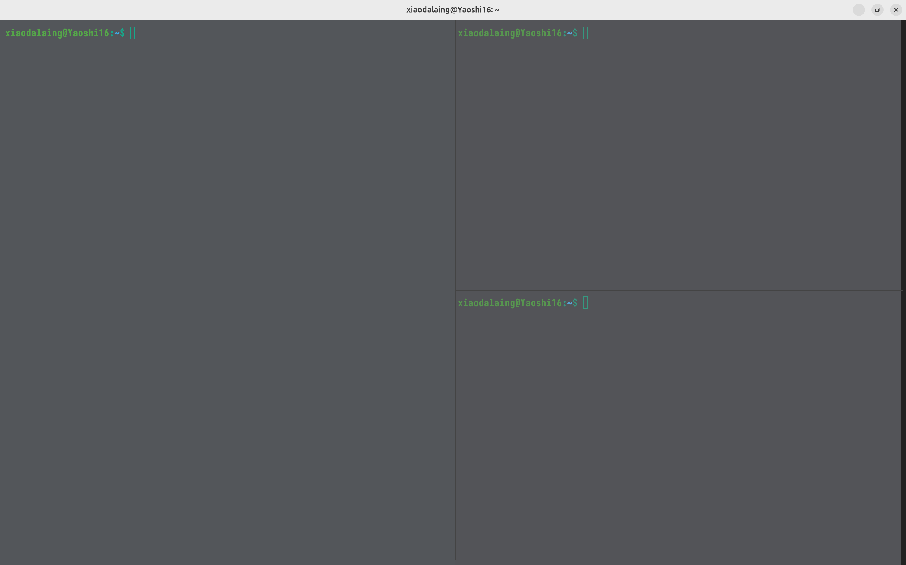

我在 Ubuntu 24.04 上使用 WezTerm，希望终端既能显示 Nerd Font 图标，也能正常显示中文。WezTerm 使用 Lua 配置，这份配置的重点是 Iosevka Nerd Font、中文回退字体，以及将入口与功能模块分开，方便后续调整。

## 1. 安装记录

当时采用 APT 仓库安装，记录的命令如下。现在重新安装时，应先核对 [WezTerm 官方 Linux 安装页](https://wezterm.org/install/linux.html)中适用于当前版本的说明。

```bash
curl -fsSL https://apt.fury.io/wez/gpg.key |
  sudo gpg --yes --dearmor -o /usr/share/keyrings/wezterm-fury.gpg

echo 'deb [signed-by=/usr/share/keyrings/wezterm-fury.gpg] https://apt.fury.io/wez/ * *' |
  sudo tee /etc/apt/sources.list.d/wezterm.list

sudo chmod 644 /usr/share/keyrings/wezterm-fury.gpg
sudo apt update
sudo apt install wezterm
```

安装完成后，可以用 `wezterm --version` 记录实际版本。笔记中未保留这一输出，因此这里无法给出准确的版本号。

2026-10-04 核查时，上述 APT 仓库步骤仍在官方说明中，没有证据将其判为废弃。不过官方单独下载的 `.deb` 表格将 Ubuntu 24 标为 Nightly Only；这不等于 APT 稳定包一定不能运行，也不能保证 Ubuntu 22 的包在 24.04 上可用。应核对实际安装包与运行结果；stable 和 nightly 包互相冲突，不要同时安装。

## 2. 先用最小入口验证配置

默认配置位置之一是 `~/.config/wezterm/wezterm.lua`，具体查找顺序见[官方配置文件说明](https://wezterm.org/config/files.html)。先使用一份完整入口，确认字体和字号能生效：

下面的 `config_builder()` 要求 WezTerm `20230320-124340-559cb7b0` 或更新版本；老版本可先用普通 Lua 表 `local config = {}`。见 [API 版本说明](https://wezterm.org/config/lua/wezterm/config_builder.html)。

```lua
local wezterm = require 'wezterm'
local config = wezterm.config_builder()

config.font = wezterm.font_with_fallback {
  { family = 'IosevkaNerdFontMono', weight = 'Regular' },
  { family = 'Noto Sans Mono CJK SC', weight = 'Regular' },
}
config.font_size = 14

return config
```

这两个名称来自当时的配置，须按本机字体库检查。`font_with_fallback` 指定字体回退顺序；配置列表不会自动安装字体。见[官方字体回退说明](https://wezterm.org/config/lua/wezterm/font_with_fallback.html)。

## 3. 再拆分模块

当配置变多后，可以采用：

```text
~/.config/wezterm/
├── wezterm.lua
└── config/
    ├── appears.lua
    ├── keys.lua
    └── launch.lua
```

此前的笔记只列出了目录结构。要让模块真正生效，入口还需要加载它，并由模块修改传入的 `config`。下面以外观模块为例说明这个约定，不代表当时配置文件的完整恢复。入口 `wezterm.lua`：

```lua
local wezterm = require 'wezterm'
local config = wezterm.config_builder()

require('config.appears').apply(config)

return config
```

外观模块 `config/appears.lua`：

```lua
local wezterm = require 'wezterm'
local M = {}

function M.apply(config)
  config.font = wezterm.font_with_fallback {
    { family = 'IosevkaNerdFontMono', weight = 'Regular' },
    { family = 'Noto Sans Mono CJK SC', weight = 'Regular' },
  }
  config.font_size = 14
end

return M
```

文件名、大小写和 `require` 名称必须一致，尤其要避免把 `appears.lua` 拼成 `appera.lua`。`keys.lua`、`launch.lua` 只有创建并实现加载约定后才加入入口。

## 4. 字体安装与检查

当时使用第三方 [Simple-NerdFonts-Downloader](https://github.com/mcarvalho1/Simple-NerdFonts-Downloader)脚本下载字体。现在选择安装方式时，还应核对字体项目的当前发行文件，不能把“脚本已运行”当作字体已安装成功。

安装后刷新缓存并查找实际字体名：

```bash
fc-cache -fv
fc-list : family | grep -i 'Iosevka'
fc-list : family | grep -i 'Noto.*CJK'
```

找不到字体时，先检查下载和安装位置；找到了但名称不同，就把 Lua 配置改为系统显示的家族名。

## 5. 配置不生效时怎么查

1. 确认编辑的是正在加载的 `wezterm.lua`，入口包含 `return config`。
2. 模块化配置时，确认文件名和 `require` 一致，模块确实修改了传入的 `config`。
3. 核对字体已经安装，家族名与系统输出一致。
4. 保存后重新加载配置或重启 WezTerm，查看是否出现 Lua 配置错误。



此前的笔记还记录过分屏与关闭窗格的快捷键，但未保留 `keys.lua`，因此这里先不列出这些绑定，也不把它们当作默认快捷键。需要补齐配置后，才能准确说明键位；关闭窗格的行为也可能依赖 shell 状态。

## 整理与核查说明

**核查状态：待复现（2026-10-04）。** 已核对官方安装文档及配置版本条件；Ubuntu 24.04 的实际安装和配置验证尚未完成。

本文整理自我的[知乎原文](https://zhuanlan.zhihu.com/p/1972808449424377512)。原页面显示更新时间为 2025-11-14 23:52，首发日期尚未确认；文章上方日期为博客整理日期。2026-10-04 整理时核对了官方安装与配置文档，补充了模块加载示例；没有在 Ubuntu 上重新安装或运行这些修订配置。

## 参考资料

- [我的知乎原文](https://zhuanlan.zhihu.com/p/1972808449424377512)
- [WezTerm：Linux 安装](https://wezterm.org/install/linux.html)
- [WezTerm：配置文件](https://wezterm.org/config/files.html)
- [WezTerm：字体回退](https://wezterm.org/config/lua/wezterm/font_with_fallback.html)
- [原参考：Ubuntu 安装 WezTerm](https://blog.longwin.com.tw/2025/05/linux-install-wezterm-terminal-2025/)
- [原参考：Windows 下的 WezTerm 配置](https://ecrof88.github.io/configtur/wezterm.html)
